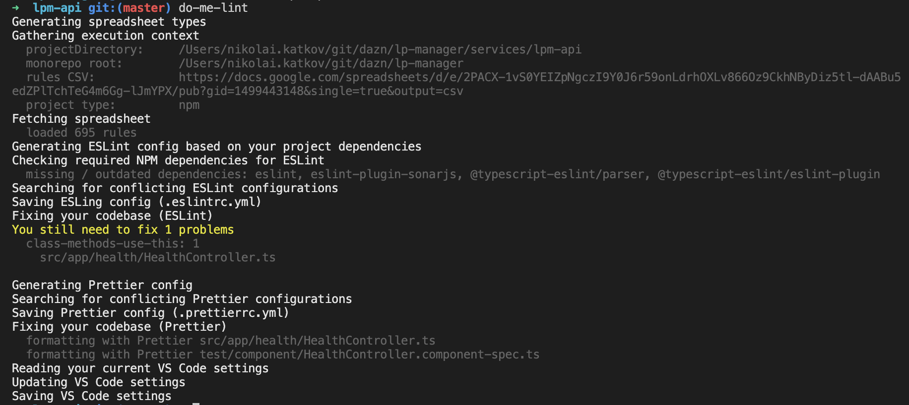
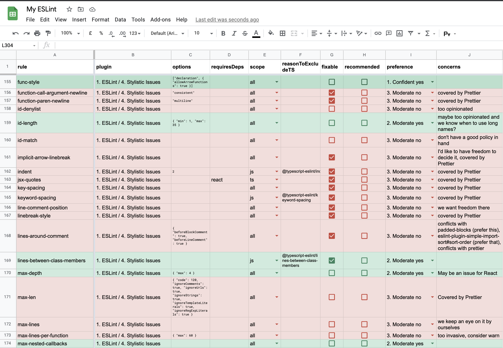
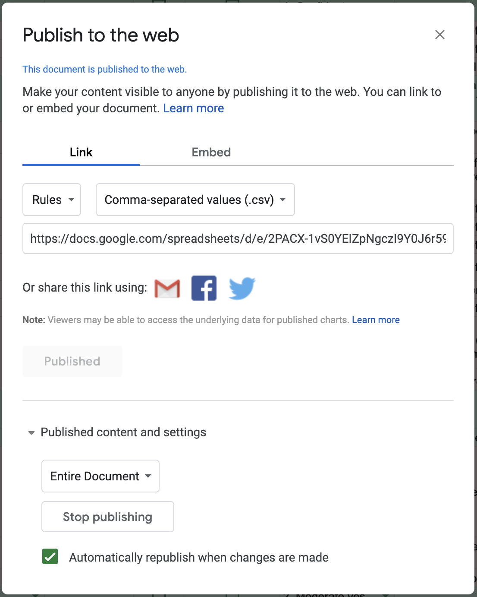

# DoMeLint

## What

CLI tool to make your JS/TS projects linted with ESLint and Prettier for the best possible developer experience.

## For whom

For busy developers who appreciate the benefits of code linting but find it tedious. For those who find themselves in the following situations:

<details>
<summary>See motivation</summary>
<p>

**I spend too much time to read ESLint rule docs.** It indicates that you are not happy with just applying recommended configs. To make a concious choice you have to learn what is considered a warning, how it might conflict with other rules, test all the rule options. **For hundreds of rules.**

**I don't remember why this rule is here.** Is your current config specific to the project? Do you keep track of the reasons to enable or disable a specific rule?

**I'm not sure if a rule is enabled in my config at all.** ESLint configurations work like layers: one recommended config can enable a rule, another one can cancel it, recommended configs are usually extended from some "base" in a tree-like hierarchy. In addition your project config may be impacted by the parent folder config unless you explicitly forbid it.

**I'd like to use modern ESLint plugins, but I have no time to monitor it.** You suspect that ESLint world is awesome, but trying out all these plugins?

**Sometimes I see more than one warning for the same code.** It indicates you have conflicting rules, or some cases are covered by Typescript.

</p>
</details>

## Features

- Configures ESLint, Prettier and your IDE (currently VSCode only)
- Scans your codebase: fixes all fixable ESLint rules and formats all files with Prettier
- Provides you a detailed report of the most common errors.
- Rules are managed in a Google spreadsheet
- Rules are finely selected for you
- Your projects gets only relevant rules. E.g. you get Typescript plugin and rules only if you have typescript as a dependency.
- All ESlint configuration is stored in a single `.eslintrc.yml` file. DoMeLint ensures there are no conflicting configurations. No extended, recommended or nested configurations - what you see is what you get.
- No configuration needed
- Still fully flexible: you can specify your file patterns, disable rules that are not worth fixing, and have completely own, team- or company-wide spreadsheet.
- Supports new projects and existing codebases
- Automatically updates linting dependencies using your project's dependency manager, Yarn or NPM
- Supports monorepos - configures IDE once for the whole repo while keeping linting configurations per project.

<details>
<summary>See it in action</summary>
<p>



</p>
</details>

## Installation

1. Clone project and install dependencies

   ```sh
   git clone https://github.com/nikolai-katkov/do-me-lint
   cd do-me-lint/
   npm install
   ```

2. Install `do-me-lint` command globally

   ```sh
   # from the do-me-lint folder

   npm install --global # preferred way

   # or
   npm link
   # or
   yarn link
   ```

## Usage

```bash
cd [path-to-your-project]
do-me-lint
```

You can achieve best results running `do-me-lint` once or periodically if you want to keep the configuration up to date.

It makes sense to keep `.domelintrc.yml` as part of your git repository.

For monorepos you need to run the script from each project's directory.

## Configuration

`do-me-lint` reads script settings in the following priority:

1. Environment variables
2. Settings in `.domelintrc.yml`
3. Default values

> All settings are optional

| Description                                         | Default                                                                                                                                                                           | Environment variable                            | Setting in `.domelintrc.yml`      |
| --------------------------------------------------- | --------------------------------------------------------------------------------------------------------------------------------------------------------------------------------- | ----------------------------------------------- | --------------------------------- |
| Pattern for Jest specs                              | src/\*\*/{\_\_tests\_\_/\*,\*.{spec,test}}.{js,ts,jsx,tsx}                                                                                                                        | `string` <br> DML_JEST_FILES                    | `string` <br> jestFiles           |
| Spreadsheet CSV <br> (for fetching rules)           | [link](https://docs.google.com/spreadsheets/d/e/2PACX-1vS0YEIZpNgczI9Y0J6r59onLdrhOXLv866Oz9CkhNByDiz5tl-dAABu5edZPlTchTeG4m6Gg-lJmYPX/pub?gid=1499443148&single=true&output=csv) | `string` <br> DML_SPREADSHEET_CSV               | `string` <br> spreadsheetCsv      |
| Spreadsheet URL (displayed in the script output)    | [link](https://docs.google.com/spreadsheets/d/149ecBpNj1mfgTKlCcVwxdKbi5VDNeJdsVW-c2Y62z9k/edit#gid=1499443148)                                                                   | `string` <br> DML_SPREADSHEET                   | `string` <br> spreadsheet         |
| Ignored rules <br> <small>will be not added</small> |                                                                                                                                                                                   | `comma-separated string` <br> DML_IGNORED_RULES | `Array<string>` <br> ignoredRules |

## Google Sheets as a source of truth



### Motivation to use Google Sheets

- More illustrative than any configuration format
- Easy to export: no API keys
- Easy to update: auto-save, no need to commit
- Inherent Google Sheets features: change history, comments, custom styling, sorting, filtering

### Forking the rules spreadsheet

1. Open a [source](https://docs.google.com/spreadsheets/d/149ecBpNj1mfgTKlCcVwxdKbi5VDNeJdsVW-c2Y62z9k/edit#gid=1499443148) spreadsheet
2. Clone it by selecting menu `File` -> `Make a copy`
3. Make any changes, add rules, enable/disable desired rules etc.
4. Export as CSV via `File` -> `Publish to the web`: <br />
5. Configure spreadsheet and CSV URLs as stated in [configuration](#configuration) section

## Uninstall

```sh

npm uninstall do-me-lint --global

# or if you installed it with npm link
npm unlink do-me-lint --global

# or if you installed it with yarn link
yarn unlink # run from the do-me-lint folder
```
